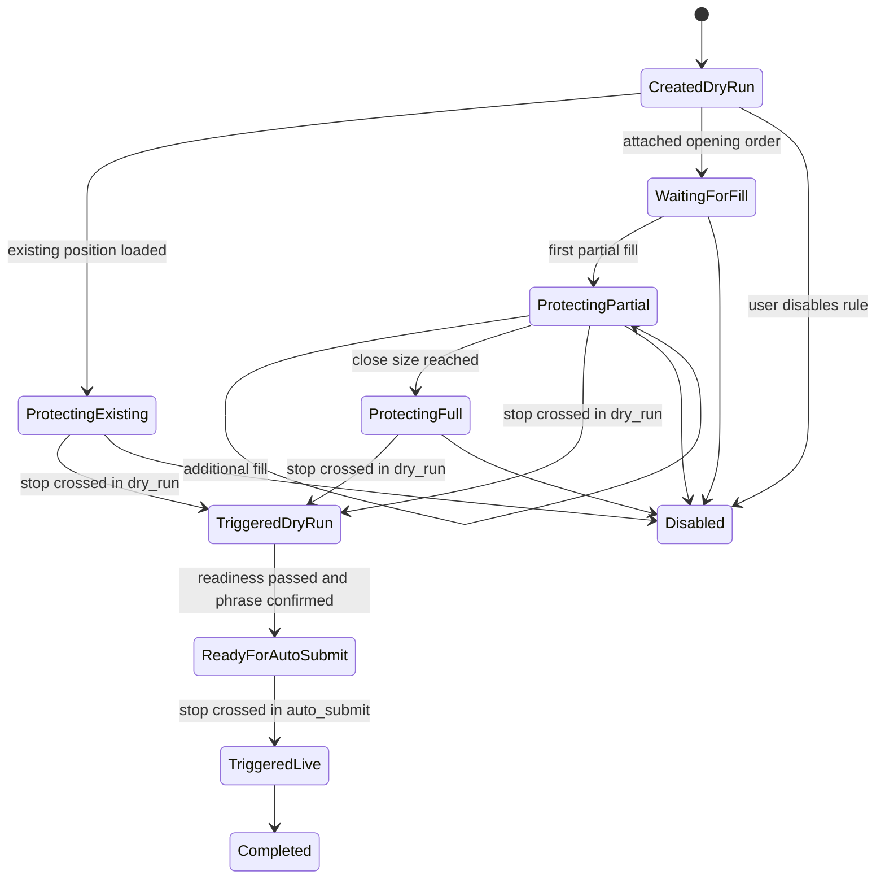

# Hyperliquid Advanced Orders Daemon - Plan

## Goal Capsule

- **Objective:** Ship the local CLI daemon MVP for Hyperliquid advanced orders, with trailing stops as the first complete workflow from rule creation through mark-price observation, partial-fill protection, dry-run audit events, readiness-gated live exits, and operator controls.
- **Authority hierarchy:** Product Contract first, then Planning Contract decisions, then Implementation Units, then implementation-time SDK details discovered while coding.
- **Execution profile:** Deep/high-risk code plan because the work touches local secret handling, persisted rule state, external trading APIs, market-data streams, and live order submission safeguards.
- **Stop conditions:** Stop and return to planning if implementation discovers a product-scope change, a signing/custody model other than local Keychain-backed signing, or a Hyperliquid SDK contract that makes the planned readiness or dry-run gates ineffective.
- **Tail ownership:** `ce-work` or goal-mode owns implementation, verification, review, and landing; the plan file is not updated with progress.

---

## Product Contract

### Summary

This project implements the separate local daemon described in the original requirements brainstorm.
The MVP is a CLI-first local daemon for Hyperliquid advanced orders, with trailing stops as the flagship workflow.
It runs locally, signs locally, uses the Hyperliquid SDK/API directly, tracks mark price, and starts every rule in `dry_run`.

Product Contract preservation: Product Contract unchanged; requirements below add stable IDs to the existing brainstorm decisions without changing behavior.

### Problem Frame

Hyperliquid traders need local automation for advanced exit behavior without moving custody or signing to a hosted service.
The first useful slice is a trailing-stop daemon that can protect existing positions or newly opening positions, observe mark prices, react to partial fills immediately, and require deliberate readiness before any mainnet submission.

### Requirements

- R1. The daemon runs locally as a CLI-first Python application before any mobile or local UI surface.
- R2. The daemon integrates with the Hyperliquid Python SDK/API directly instead of shelling out to a generated CLI.
- R3. Private keys stay local and are retrieved from macOS Keychain for signing.
- R4. Trailing stops protect both long and short positions.
- R5. Trailing stops support percent, absolute-value, and moving-average trail modes.
- R6. Mark price is the trigger source for trailing-stop evaluation.
- R7. The trader chooses the close size protected by a rule.
- R8. Rules can protect an existing position or attach to a newly opening order.
- R9. Partial fills increase protection immediately, up to the rule's configured close size.
- R10. Every rule starts in `dry_run`, and dry-run events are auditable.
- R11. Mainnet `auto_submit` is per-rule and requires readiness checks plus the phrase `ENABLE MAINNET AUTO SUBMIT`.
- R12. A kill switch blocks automated live submissions without preventing local inspection or audit review.

### Scope Boundaries

#### Deferred for Later

- Local UI and mobile app surfaces.
- Advanced order types beyond trailing stops.
- Hosted custody, cloud signing, or remote daemon control.
- Multi-user team workflows, shared configuration sync, and hosted alerting.

#### Outside This Product's Identity

- Subprocess-based automation through a separate generated CLI.
- Any design that requires private keys to leave the local machine.
- Exchange-side trigger-order emulation as the primary MVP mechanism.

---

## Planning Contract

### Key Technical Decisions

- KTD1. Persist rules and runtime state locally behind repository-owned storage interfaces.
  The current code has in-memory domain objects and a JSONL audit log but no durable rule store, so implementation should add a small local state layer rather than coupling daemon behavior to Typer callbacks or ad hoc files.
- KTD2. Keep Hyperliquid SDK usage behind local gateway interfaces.
  The installed `hyperliquid-python-sdk` 0.24.0 exposes `Info.all_mids`, `Info.meta`, `Info.user_state`, `Info.user_fills`, `Info.subscribe`, `Exchange.market_close`, and `Exchange.order`; wrapping those calls keeps rule evaluation testable and prevents SDK response shapes from leaking through the engine.
- KTD3. Use mark-price data from SDK information surfaces and normalize it before rule evaluation.
  SDK type definitions expose `activeAssetCtx` messages with `markPx`, while `all_mids` returns mid prices; implementation should prefer the mark-price-capable subscription/snapshot path when available and record a fallback assumption if the SDK version requires polling a different info endpoint.
- KTD4. Treat partial-fill protection as a state update, not as exchange-native trigger placement.
  Fill observation should increase each attached rule's protected size up to the configured close size and let the existing trailing engine decide when an exit is triggered.
- KTD5. Route all exit decisions through a submission policy.
  `dry_run` emits audit events only; `auto_submit` requires readiness, inactive kill switch, Keychain availability, observed live mark price, prior dry-run evidence, and the exact confirmation phrase before it can call the SDK.
- KTD6. Use reduce-only exit submissions for live protection.
  The SDK's `Exchange.market_close` path derives close side from current position and submits reduce-only market-style IoC orders, which matches the MVP safety posture better than free-form opening orders.
- KTD7. Make the daemon loop explicit and testable.
  A daemon service should coordinate market data, fill updates, rule state, readiness, submission, and audit logging; CLI commands should configure and invoke the service rather than owning business logic.
- KTD8. Treat the current scaffold gaps as launch blockers, not deferred polish.
  The MVP is not ready until `run` performs real bounded daemon work, rule creation persists actionable state, kill switch state is enforced by submission policy, readiness is called on the live path, README commands match reality, and repository tests are discoverable by the documented command.

### High-Level Technical Design

```mermaid
flowchart TB
  CLI[Typer CLI] --> Store[Local rule and state store]
  CLI --> Secrets[Keychain secrets]
  CLI --> Daemon[Daemon service]
  Daemon --> Store
  Daemon --> Market[Hyperliquid market data gateway]
  Daemon --> Fills[Hyperliquid fill and position gateway]
  Market --> Engine[Trailing stop engine]
  Fills --> Engine
  Engine --> Policy[Submission policy]
  Policy --> Audit[JSONL audit log]
  Policy -->|dry_run| Audit
  Policy -->|auto_submit when ready| Exchange[Hyperliquid exchange gateway]
  Exchange --> Audit
  Kill[Kill switch] --> Policy
```

The daemon keeps orchestration separate from the existing trailing-stop math.
Market-data and fill gateways translate SDK responses into domain events.
The engine updates rule state and produces `TriggeredExit` values.
The submission policy decides whether a triggered exit becomes a dry-run audit event or a live reduce-only SDK call.

The lifecycle preserves the brainstorm's safety posture: a rule begins in `dry_run`, can accumulate protected size from existing positions or fills, and only enters live submission through a separate readiness transition.

### Sources & Research

- `pyproject.toml` defines a Python 3.11+ package with Typer, Pydantic, Keyring, and `hyperliquid-python-sdk>=0.24.0`.
- `src/hl_advanced_orders/trailing.py` already contains the core trailing-stop engine and state object for percent, absolute, moving-average, long, short, and partial-size behavior.
- `src/hl_advanced_orders/cli.py` already uses Typer and writes rule-created and kill-switch audit events.
- `src/hl_advanced_orders/readiness.py` already encodes the mainnet confirmation phrase and readiness checks but is not yet wired into daemon execution.
- Installed SDK inspection confirmed `hyperliquid-python-sdk` 0.24.0 methods and response notes for `Info` and `Exchange`; current local inspection shows `Info.meta_and_asset_ctxs` returns asset context entries with `markPx`, `Info.subscribe` supports active asset context subscriptions unless `skip_ws` is used, and `Exchange.market_close` wraps a reduce-only IoC order through `Exchange.order`.
- MVP readiness review on 2026-06-30 found the app is still scaffold-only: `run` does not run the daemon, rule creation only appends audit history, the kill switch is not persisted or enforced, readiness is not wired to submission, README advertises unwired behavior, and `python -m unittest` discovers zero tests from the repo root.

### Assumptions

- Local JSON files are acceptable for MVP rule and state persistence, matching the current JSONL audit style and avoiding an unnecessary database.
- The daemon may begin with a polling-capable market-data path and add WebSocket subscriptions where the SDK surface is reliable enough for tests and shutdown behavior.
- The MVP can use reduce-only market exits for triggered live stops; limit exit order type remains modeled but does not need full live submission parity until the market path is safe.

### System-Wide Impact

- **Local state lifecycle:** Rule state, protected size, triggered flags, kill-switch state, and audit history must stay consistent across daemon restarts because a restart during an open position is normal operator behavior.
- **Secret boundary:** Keychain access belongs only in the secrets and exchange-gateway path; CLI listing, storage, audit, tests, and readiness output must never expose private key material.
  Secret-entry commands must avoid shell-history-visible private-key arguments and must not echo entered key material.
- **External API boundary:** SDK payload parsing must be isolated so a Hyperliquid response-shape change fails at the gateway boundary with an auditable reason instead of corrupting rule state.
- **Failure propagation:** Market-data gaps, fill-fetch failures, SDK submission failures, malformed state, and active kill switch should produce blocked or failed audit events while leaving state inspectable for manual recovery.
- **Operator interface parity:** Every safety-critical state transition available to the daemon should be inspectable from CLI output or audit logs, including why a live submission was blocked.
- **MVP readiness posture:** Documentation and CLI output must not describe scaffold behavior as working automation; if a command remains intentionally dry-run-only or fake-gateway-only, that limitation must be visible in help text, README examples, and tests.

### Risks & Dependencies

- **Mark-price source ambiguity:** The product requires mark price, while common SDK info helpers also expose mid-price data.
  Mitigation: gateway tests must distinguish mark-price payloads from mid-price fallback, and live submission remains blocked until a live mark price has been observed for the rule.
- **Live order safety:** A bug in side, size, or reduce-only mapping could increase exposure instead of closing it.
  Mitigation: live exits route through one submission component, use reduce-only close behavior, and require tests for long and short close mapping before `auto_submit` is available.
- **Partial-fill race:** Fill observation and price observation can arrive in different orders.
  Mitigation: protected size updates are idempotent, capped at configured close size, and persisted before trigger evaluation for attached opening-order rules.
- **Local file corruption:** JSON state can be interrupted or edited by hand.
  Mitigation: storage should write atomically where practical, fail loudly on malformed files, and leave audit history append-only.
- **SDK/documentation drift:** Official docs were unreachable from this environment, and the installed SDK may change after dependency updates.
  Mitigation: implementation must re-check installed SDK signatures and reachable official docs before enabling live submission behavior.
- **Secret entry leakage:** A CLI command that accepts a private key as a normal option can leak through shell history or process inspection.
  Mitigation: key storage must use a non-echoing prompt or another non-history path and must test that help, output, audit logs, and persisted state never contain private-key material.
- **False readiness from passing shallow checks:** Lint and trailing-engine tests can pass while the product remains unusable.
  Mitigation: verification must include an end-to-end dry-run CLI workflow, persisted rule reload, kill-switch enforcement, readiness-blocked live submission, and README/test-command parity before the MVP can be called ready.

---

## Implementation Units

### U1. Local Rule And State Persistence

- **Goal:** Add durable local storage for trailing-stop rules, protected-size state, kill-switch state, and daemon checkpoints.
- **Requirements:** R1, R4, R5, R7, R8, R9, R10, R12
- **Dependencies:** None
- **Files:** Create `src/hl_advanced_orders/storage.py`; modify `src/hl_advanced_orders/models.py`; test in `tests/test_storage.py`.
- **Approach:** Introduce repository-owned persistence types that serialize existing dataclass domain objects to JSON under the current application data directory.
  Keep audit logging append-only in `audit.py`; storage owns current state and audit owns history.
  Include schema/version handling so future plan work can migrate state without breaking existing local files.
- **Execution note:** Implement persistence behavior test-first because later daemon units depend on stable load/save semantics.
- **Patterns to follow:** `src/hl_advanced_orders/audit.py` for local file creation and JSON encoding; `src/hl_advanced_orders/models.py` for domain enum names and `Decimal` values.
- **Test scenarios:**
  - Creating a trailing rule persists `dry_run` execution mode, coin, side, close size, trail mode, trail value, and generated rule ID, then loads the same values back.
  - Saving runtime state with protected size `0.4` for a rule with size `1.0` reloads the protected size as a `Decimal`, not a float-rounded value.
  - Creating a rule through the current CLI path no longer leaves only an audit event; a subsequent store load can retrieve the rule and its runtime state.
  - Loading from a missing store returns an empty rule set and inactive kill switch.
  - Loading malformed JSON fails with a clear storage error and does not delete the existing file.
  - Enabling the kill switch persists across a new store instance.
- **Verification:** Storage round-trips all MVP rule and state fields without precision loss, and malformed local state is visible to the operator instead of silently ignored.

### U2. Hyperliquid Gateway Interfaces

- **Goal:** Add testable wrappers for Hyperliquid account, market-data, fill, and exchange operations.
- **Requirements:** R2, R3, R6, R8, R9, R11
- **Dependencies:** U1 for persisted account/rule context where needed.
- **Files:** Create `src/hl_advanced_orders/hyperliquid_client.py`; modify `src/hl_advanced_orders/secrets.py`; test in `tests/test_hyperliquid_client.py`.
- **Approach:** Define local gateway protocols or small classes for market metadata, mark-price observation, user positions, user fills, and reduce-only exits.
  Convert SDK string/float-shaped fields to `Decimal` and domain-side values at the boundary.
  Treat mid-price fallbacks as degraded market observations that do not satisfy the live mark-price readiness gate.
  Keep wallet construction and private-key retrieval isolated so most tests use fakes and do not touch Keychain or the network.
- **Patterns to follow:** `src/hl_advanced_orders/readiness.py` for Keychain dependency injection; installed `hyperliquid.info.Info` and `hyperliquid.exchange.Exchange` surfaces for the SDK calls to wrap.
- **Test scenarios:**
  - A fake SDK mark-price payload for `ETH` becomes a `PriceTick` with uppercase coin and `Decimal` mark price.
  - A fake SDK `all_mids` fallback can feed dry-run observation but is labeled as non-mark data and does not set `observed_live_mark_price`.
  - A user position with positive size maps to a long existing-position candidate; a negative size maps to short; zero-size entries are ignored.
  - User fill payloads for an attached opening order increase protected size only for matching coin, side, and order identity.
  - Missing Keychain private key prevents exchange gateway construction for live submission.
  - A live exit request for a long rule maps to a reduce-only close operation with the protected size, while `dry_run` never constructs an exchange call.
- **Verification:** SDK response parsing and signing setup are hidden behind local interfaces, and unit tests can exercise daemon logic without network or Keychain access.

### U3. Daemon Orchestration Service

- **Goal:** Wire persisted rules, market prices, fills, trailing-stop evaluation, submission policy, and audit logging into a daemon service.
- **Requirements:** R1, R4, R5, R6, R8, R9, R10, R12
- **Dependencies:** U1, U2
- **Files:** Create `src/hl_advanced_orders/daemon.py`; modify `src/hl_advanced_orders/trailing.py`; test in `tests/test_daemon.py`.
- **Approach:** Build an orchestration layer that can run one deterministic tick in tests and a continuous loop from the CLI.
  The service loads active rules, updates protected sizes from fills or existing positions, observes mark prices, asks the trailing engine for triggered exits, hands exits to an injected submission-policy interface, writes audit events from that policy result, and saves updated state.
  Keep loop timing and shutdown mechanics outside the engine so tests can run without sleeping.
- **Execution note:** Add characterization coverage for current trailing-engine behavior before changing any engine state fields or trigger semantics.
- **Patterns to follow:** `tests/test_trailing.py` for direct domain tests; `src/hl_advanced_orders/audit.py` for audit event shape.
- **Test scenarios:**
  - An existing long position protected by a percent trailing rule observes rising mark prices, raises the stop, then emits a dry-run exit audit when mark price crosses the stop.
  - A short absolute trailing rule emits a buy-side exit when mark price rises through the stop.
  - A rule attached to a new opening order starts with protected size zero, receives a partial fill, immediately protects that filled size, and later caps protection at the user-chosen close size.
  - A mark-price tick for another coin leaves the rule state unchanged.
  - A triggered rule is not submitted or audited twice on subsequent ticks unless implementation defines a deliberate reset path.
  - An injected fake policy that reports a blocked live submission causes the daemon to persist state and write the blocked audit event without retrying the exit in the same tick.
  - The CLI `run` command delegates to the daemon service and can execute a bounded dry-run tick; it no longer only prints a scaffold message.
- **Verification:** The daemon service can be exercised with fake gateways in deterministic tests, and each rule transition writes both updated local state and an audit event when behavior changes.

### U4. Readiness-Gated Submission Policy

- **Goal:** Connect readiness checks, confirmation phrase handling, dry-run history, kill-switch state, and live reduce-only submission.
- **Requirements:** R3, R10, R11, R12
- **Dependencies:** U1, U2, U3
- **Files:** Modify `src/hl_advanced_orders/readiness.py`; create `src/hl_advanced_orders/submission.py`; test in `tests/test_readiness.py` and `tests/test_submission.py`.
- **Approach:** Keep `ReadinessChecker` as the policy input validator and add a submission component that receives `TriggeredExit` values.
  The component writes dry-run audit events for `dry_run`, blocks `auto_submit` until readiness passes, and submits live exits only through the Hyperliquid exchange gateway.
  Readiness must account for Keychain private key presence, market existence, observed live mark price, inactive kill switch, prior dry-run event, and exact phrase match.
- **Patterns to follow:** `src/hl_advanced_orders/readiness.py` for the existing readiness model; `src/hl_advanced_orders/models.py` for `ExecutionMode` and `TriggeredExit`.
- **Test scenarios:**
  - A dry-run triggered exit appends an audit event and makes no exchange gateway call.
  - `auto_submit` with a missing private key, missing market, no live mark observation, active kill switch, no dry-run history, or wrong phrase records blocked reasons and makes no exchange call.
  - A rule cannot move from `dry_run` to `auto_submit` unless readiness was evaluated against persisted rule state and a prior dry-run audit event for that rule exists.
  - `auto_submit` with all readiness conditions satisfied calls the exchange gateway once and records the SDK response summary in the audit log.
  - The confirmation phrase check is exact and case-sensitive for `ENABLE MAINNET AUTO SUBMIT`.
  - A live submission failure records a failure audit event and leaves rule state inspectable for retry or manual intervention.
- **Verification:** No test path can reach a live exchange call without passing readiness, and each blocked reason is visible to the operator.

### U5. CLI Workflows For Rules, Secrets, Readiness, And Daemon Control

- **Goal:** Expose the MVP workflows through Typer commands without moving business logic into command handlers.
- **Requirements:** R1, R3, R7, R8, R10, R11, R12
- **Dependencies:** U1, U2, U3, U4
- **Files:** Modify `src/hl_advanced_orders/cli.py`; test in `tests/test_cli.py`; update `README.md`.
- **Approach:** Extend the existing CLI with commands to initialize state, store or verify an account key, create/list/disable trailing rules, attach rules to existing positions or opening-order identifiers, inspect readiness, run the daemon loop, and enable/disable the kill switch.
  Secret-entry commands must use a non-echoing prompt or another non-history path rather than a normal private-key option.
  CLI handlers should parse arguments, call services, and print operator-facing summaries; they should not contain SDK parsing or trailing-stop math.
  The current scaffold wording should be removed once the daemon service is wired; if a command is operating in bounded test mode, the output should say so instead of implying live market monitoring.
- **Patterns to follow:** Existing Typer app and `parse_decimal` helper in `src/hl_advanced_orders/cli.py`; current README development section.
- **Test scenarios:**
  - Creating a trailing rule through the CLI stores the rule in `dry_run`, writes a rule-created audit event, and prints the rule ID.
  - Invalid size, invalid trail value, or percent trail value greater than or equal to 100 returns a CLI parameter error.
  - Listing rules shows execution mode, side, size, protected size, and disabled/triggered state without exposing private keys.
  - Readiness inspection prints all failing readiness reasons for a rule that is not eligible for `auto_submit`.
  - Enabling the kill switch through the CLI persists state and causes the next daemon tick to block live submission.
  - Disabling the kill switch through the CLI persists state and allows readiness to continue evaluating other gates without bypassing them.
  - The daemon run command can execute a single tick or bounded test mode without opening network connections when fake gateways are injected.
  - Key storage does not expose private-key material in command output, help text examples, audit payloads, or persisted state.
- **Verification:** Operators can create, inspect, and run MVP trailing-stop workflows from the CLI while services remain separately testable.

### U6. Audit, Documentation, And Operational Safety Pass

- **Goal:** Make the daemon's local safety model understandable, auditable, and verifiable for development and operator use.
- **Requirements:** R1, R3, R10, R11, R12
- **Dependencies:** U1, U2, U3, U4, U5
- **Files:** Modify `src/hl_advanced_orders/audit.py`, `README.md`; create or update tests in `tests/test_audit.py` and `tests/test_cli.py`.
- **Approach:** Standardize audit event types and payloads for rule creation, rule state changes, dry-run triggers, blocked live submissions, live submission attempts, live submission failures, live submission successes, readiness checks, and kill-switch changes.
  Update README usage so a developer can install, run the discoverable test command, create a rule, run in dry-run, inspect readiness, and understand the live-submission gate.
  README status should change from "early scaffold" only when the end-to-end dry-run workflow and live-submission blocks are implemented and verified.
- **Patterns to follow:** Existing `AuditEvent.create` API and README Safety Model section.
- **Test scenarios:**
  - Audit events are valid JSONL, include UTC timestamps, and sort payload keys consistently.
  - Dry-run and live-submission audit payloads include rule ID, coin, side, size, mark price, stop price, execution mode, and outcome.
  - Audit events never include private key material.
  - README examples match available CLI commands, document `python -m unittest discover -s tests`, and preserve the `dry_run` default plus confirmation phrase warning.
- **Verification:** The safety-critical path is inspectable through audit logs and documented without requiring the reader to inspect source code.

---

## Verification Contract

| Gate | Applies to | Expected signal |
|---|---|---|
| `python -m unittest discover -s tests` | All units | All unit and integration tests pass. Plain `python -m unittest` currently discovers zero tests, so discovery must target `tests`. |
| `ruff check .` | All units | Lint passes under the repo's configured Python 3.11 target and 100-character line length. |
| CLI smoke tests via Typer runner or subprocess | U5, U6 | Rule creation, listing, readiness inspection, kill switch, and bounded daemon execution behave without network access when fake gateways are used. |
| End-to-end dry-run workflow | U1, U3, U4, U5, U6 | A rule created through the CLI persists, reloads, observes fake mark prices/fills, emits a dry-run trigger audit, and does not call the exchange gateway. |
| Manual SDK contract check | U2, U4 | Implementation re-checks installed SDK signatures and, where reachable, official Hyperliquid docs for mark-price and reduce-only close behavior before enabling live submission. |
| Safety audit review | U4, U6 | No code path submits live orders in `dry_run`, with active kill switch, without Keychain key, without observed live mark price, without prior dry-run audit, or without exact confirmation phrase. |
| README and status parity | U5, U6 | README setup, test, dry-run, readiness, and kill-switch instructions match the implemented CLI; scaffold-only disclaimers are either still accurate or removed because the workflow is real. |

---

## Definition of Done

- The plan's Product Contract requirements R1 through R12 are implemented or explicitly blocked by a returned scope contradiction.
- Rules persist locally, start in `dry_run`, can protect existing positions or attached opening-order fills, and update protected size immediately on partial fills.
- Trailing-stop behavior remains covered for long/short, percent/absolute/moving-average modes, mismatched coins, triggered-state idempotency, and protected-size caps.
- Hyperliquid SDK interactions are isolated behind local gateways that can be faked in tests and do not require network or Keychain access for normal unit tests.
- Mainnet `auto_submit` cannot execute unless readiness passes, kill switch is inactive, a prior dry-run event exists, and the exact confirmation phrase was supplied.
- Audit logs contain enough information to reconstruct rule creation, protection changes, dry-run triggers, blocked submissions, and live submission outcomes without exposing private keys.
- README and CLI help describe the local-first safety model, setup, dry-run workflow, readiness workflow, and kill switch.
- The six MVP readiness blockers identified on 2026-06-30 are closed: daemon run is real and bounded-testable, rules persist beyond audit append, kill switch state is enforced, readiness gates the live path, README does not overstate capability, and the documented test command discovers tests.
- Verification Contract gates pass, and abandoned experimental code or unused scaffolding is removed before handoff.
