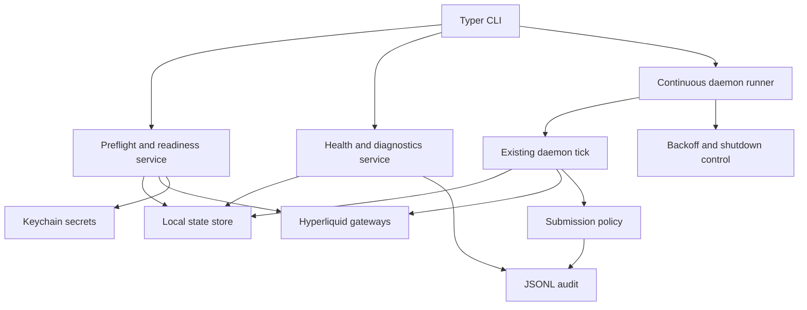
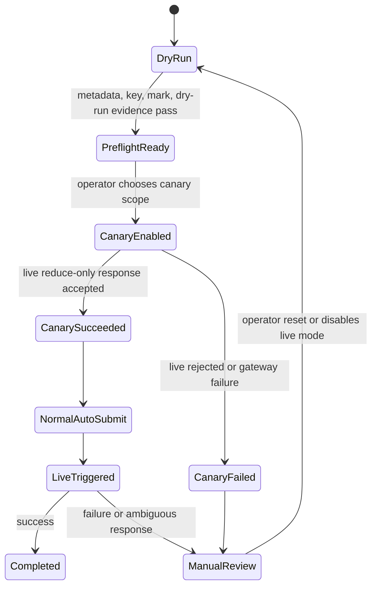

# Trader Readiness - Plan

## Goal Capsule

- **Objective:** Turn the merged local Hyperliquid trailing-stop MVP into a trader-ready local daemon with continuous operation, operator controls, preflight safety gates, canary/live validation, recovery behavior, and packaging documentation.
- **Authority hierarchy:** Existing local-first safety model first, then this trader-readiness plan, then implementation-time SDK details discovered while coding.
- **Execution profile:** Deep/high-risk code plan because the work touches live trading automation, local signing, external API behavior, persisted state, and unattended process operation.
- **Stop conditions:** Stop and return to planning if implementation requires hosted custody, cloud signing, exchange-side trigger orders as the primary mechanism, or live submission behavior that cannot be tested behind fake gateways before real use.
- **Tail ownership:** `ce-work` or a human implementer owns implementation, verification, review, and landing; this plan is not updated with execution progress.

---

## Product Contract

### Summary

The current app is a strong local MVP: rules persist, one bounded daemon tick can evaluate mark prices and fills, readiness gates live submission, and tests cover the core dry-run and live-blocked paths.
Trader readiness means the app can be responsibly operated by a real trader on a local machine, with clear startup/shutdown behavior, repeatable dry-run and canary workflows, state recovery, live safety controls, and documentation that does not require reading the source.

This plan keeps the original product identity intact: local CLI daemon, local signing, Hyperliquid SDK/API integration, trailing stops first, dry-run by default, and per-rule `auto_submit`.
It does not add a hosted backend, mobile app, cloud signing, or new advanced order families.

### Problem Frame

The merged MVP proves the domain model and safety gates, but a trader still lacks the operational confidence to leave it running.
The main gaps are continuous operation, durable process lifecycle, automated market validation, preflight visibility, live canary workflow, state inspection and recovery, and packaging/runbook guidance.
Without those pieces, unit tests can pass while a real trader still faces avoidable failure modes: stale market data, accidental wrong network/base URL, repeated restarts, unclear live eligibility, no clear heartbeat, and no documented rollback path.

### Requirements

**Daemon Operation**

- R1. The daemon supports a continuous local run mode with configurable poll interval, graceful shutdown, and bounded `--once` behavior preserved for tests and manual checks.
- R2. Continuous operation emits heartbeat and health information that shows tick progress, active rules, last successful market/account snapshot, and blocked live-submit reasons.
- R3. The daemon handles transient market-data, account, and submission failures with auditable backoff/retry behavior that does not duplicate live exits.

**Trading Safety**

- R4. Live submission remains reduce-only market close only; limit exits, bracket logic, and exchange-native trigger orders stay out of scope for this plan.
- R5. Live readiness validates market existence from Hyperliquid metadata instead of relying on the operator-only `--market-exists` assertion.
- R6. Live readiness requires a fresh mark-price observation, a recent dry-run trigger for the same rule shape, inactive kill switch, Keychain key presence, and the exact confirmation phrase.
- R7. The operator can run a canary workflow against testnet or an explicitly configured small-size mainnet rule before enabling normal live `auto_submit`.
- R8. A triggered live failure stays inspectable and cannot loop into repeated submission attempts without an explicit operator reset.

**Operator Experience**

- R9. CLI commands expose preflight checks, rule status, daemon health, audit summaries, and reset/disable controls without exposing private key material.
- R10. State recovery tools can validate local state, export redacted diagnostics, and safely reset a stuck triggered rule only when the operator chooses that action.
- R11. Documentation provides a dry-run-to-live runbook, startup examples, shutdown/recovery instructions, and a clear readiness checklist.
- R12. Packaging gives traders a repeatable install and launch path for macOS local use without requiring source-tree knowledge.

### Scope Boundaries

#### Deferred for Later

- Local UI, mobile UI, hosted dashboard, and remote control.
- Additional order types beyond trailing stops.
- Limit-exit strategy, bracket orders, exchange-native trigger orders, and portfolio-level risk management.
- Multi-account/team workflows, configuration sync, alerting services, and notification integrations.
- Formal financial, legal, or compliance certification.

#### Outside This Product's Identity

- Hosted custody or any design where private keys leave the local machine.
- Subprocess automation through another generated CLI.
- Cloud daemon deployment as the primary operating mode.

---

## Planning Contract

### Key Technical Decisions

- KTD1. Add continuous operation without changing the existing deterministic `run_once` core.
  The current `DaemonService.run_once` is a good unit-test boundary; a new runner should own loop timing, signal handling, backoff, and health state.
- KTD2. Treat metadata-backed market validation as a readiness input, not a manual operator flag.
  `--market-exists` is useful as an MVP escape hatch, but trader readiness should derive market existence from the Hyperliquid gateway and record the checked source.
- KTD3. Make health a persisted and auditable operator surface.
  The daemon should expose last tick time, last successful market/account snapshots, active failures, and last blocked reasons through CLI output and audit events.
- KTD4. Keep live exit behavior narrow.
  The installed SDK exposes `Exchange.market_close`, `Exchange.order`, `set_expires_after`, and `schedule_cancel`; this plan keeps live submission on reduce-only market close and defers broader order semantics.
- KTD5. Add a canary gate before normal live operation.
  Passing unit tests and dry-run audit history are necessary but not sufficient for a trader; a testnet or explicitly small-size canary produces evidence that live gateway wiring, signing, response parsing, and audit behavior work together.
- KTD6. Prefer explicit operator reset over automatic retry after live submission failure.
  The current submission path keeps failed live rules triggered to avoid duplicate retry; trader readiness should make that state visible and resettable rather than silently retrying.
- KTD7. Package for a local macOS operator first.
  The product already uses macOS Keychain and `~/Library/Application Support`; installation, launch, and runbook docs should focus there before Linux services or hosted deployment.

### High-Level Technical Design

### Sources & Research

- `docs/plans/2026-06-29-001-feature-hyperliquid-advanced-orders-daemon-plan.md` defines the implemented MVP scope and safety posture this plan extends.
- `README.md` documents the current local workflow, including `run --once`, manual `--market-exists`, Keychain storage, and readiness gates.
- `src/hl_advanced_orders/daemon.py` has the deterministic tick boundary, mark-price filtering, protected-size updates, and kill-switch refresh behavior to preserve.
- `src/hl_advanced_orders/submission.py` centralizes dry-run audit, readiness-blocked live submission, exchange response rejection detection, and live failure audit events.
- `src/hl_advanced_orders/hyperliquid_client.py` wraps `Info.meta_and_asset_ctxs`, `Info.all_mids`, `Info.user_state`, `Info.user_fills`, and `Exchange.market_close`.
- Installed `hyperliquid-python-sdk` 0.24.0 exposes `Info.subscribe`, `Info.unsubscribe`, `Exchange.set_expires_after`, and `Exchange.schedule_cancel`, which can support future streaming or emergency-cancel work without changing this plan's live-exit scope.
- Public SDK source at `https://github.com/hyperliquid-dex/hyperliquid-python-sdk` confirms `market_close`, `schedule_cancel`, and metadata/account info surfaces are first-class SDK paths.
- Official Hyperliquid GitBook pages for exchange, websocket, and rate-limit docs returned HTTP 403 from this environment on 2026-06-30; implementation must recheck official docs from a browser or authenticated network before enabling unattended live operation.

### Assumptions

- A local JSON state store remains acceptable for trader readiness if writes stay atomic and diagnostics can validate state.
- A polling loop is acceptable for the first trader-ready daemon; WebSocket subscriptions can be added behind the same gateway boundary when shutdown and reconnect behavior are proven.
- Testnet or a tiny explicitly configured mainnet close size is acceptable as canary evidence; the plan does not decide the trader's risk amount.
- macOS launch guidance can be documentation-first; a fully managed installer is not required before trader readiness.

### System-Wide Impact

- **Trading exposure:** Any loop, retry, or reset change can affect live positions, so defaults must fail closed and leave auditable evidence.
- **Local state:** Health, canary status, live eligibility, and reset decisions become part of persisted operator context.
- **CLI contract:** Current commands stay usable, but new trader-ready commands and flags become documented operator interfaces.
- **Security boundary:** Diagnostics and health output must stay redacted and must not reveal private keys, seed phrases, or signing payloads.
- **External API boundary:** Metadata, rate-limit, and response-shape checks must remain in Hyperliquid gateway code so business logic stays testable with fakes.

### Risks & Dependencies

- **Unattended duplicate exits:** A retry loop could submit more than once after ambiguous responses.
  Mitigation: keep triggered-live failure in manual-review state until an explicit reset or reconciliation confirms safety.
- **Stale data decisions:** A daemon loop can act on old mark or account data if freshness is not modeled.
  Mitigation: preflight and tick evaluation must carry timestamps and block live action when snapshots are stale.
- **Manual readiness drift:** The current `--market-exists` flag can be wrong.
  Mitigation: replace it on the live path with metadata-backed validation while preserving manual override only for non-live diagnostics if needed.
- **Operator overconfidence:** Passing fake-gateway tests does not prove live safety.
  Mitigation: require documented dry-run evidence plus canary evidence before normal live operation.
- **SDK/docs drift:** SDK signatures and exchange response shapes can change.
  Mitigation: pin or record the tested SDK version, recheck official docs before live enablement, and keep response parsing tests around representative payloads.

---

## Implementation Units

### U1. Continuous Runner And Health State

- **Goal:** Add a continuous local daemon runner that preserves `run_once` as the deterministic core and exposes health state.
- **Requirements:** R1, R2, R3
- **Dependencies:** None
- **Files:** Modify `src/hl_advanced_orders/daemon.py`, `src/hl_advanced_orders/storage.py`, `src/hl_advanced_orders/models.py`, `src/hl_advanced_orders/cli.py`; test in `tests/test_daemon_runner.py` and `tests/test_cli.py`.
- **Approach:** Introduce a runner layer that calls the existing tick repeatedly with configurable poll interval, max consecutive failures, graceful shutdown, and heartbeat persistence.
  Health state should record last tick start/end, last successful market/account snapshot, consecutive failure count, current mode, and last blocked live reasons.
  Keep sleeping and signal handling outside `DaemonService.run_once` so existing deterministic tests remain stable.
- **Patterns to follow:** Existing `DaemonService.run_once` orchestration and `LocalStateStore.save_preserving_active_kill_switch`.
- **Test scenarios:**
  - Starting the runner with two configured iterations calls the tick twice and persists updated heartbeat timestamps.
  - A transient market-data failure records failure count and audit event, then a later successful tick clears or demotes the active health error.
  - A shutdown request between ticks exits without starting another tick and leaves state loadable.
  - `run --once` continues to execute exactly one tick and does not enter the continuous runner.
  - Continuous mode rejects zero or negative poll intervals with a CLI parameter error.
- **Verification:** A trader can run the daemon continuously and inspect whether it is alive without weakening the existing unit-test boundary.

### U2. Metadata-Backed Preflight Readiness

- **Goal:** Replace manual live market assertions with a preflight service that validates market metadata, data freshness, account access, and rule eligibility.
- **Requirements:** R5, R6, R9
- **Dependencies:** U1
- **Files:** Modify `src/hl_advanced_orders/hyperliquid_client.py`, `src/hl_advanced_orders/readiness.py`, `src/hl_advanced_orders/cli.py`; create `src/hl_advanced_orders/preflight.py`; test in `tests/test_preflight.py`, `tests/test_hyperliquid_client.py`, and `tests/test_cli.py`.
- **Approach:** Add gateway methods that return market metadata and checked timestamps for configured rule coins.
  Build a preflight summary per rule with market existence, mark freshness, account snapshot availability, Keychain status, kill-switch state, dry-run evidence, and confirmation phrase status.
  Live `auto_submit` should use this summary instead of relying on `--market-exists`; any manual flag should be limited to non-live diagnostics or removed from live operation.
- **Patterns to follow:** `ReadinessChecker.check_mainnet_auto_submit` for reason aggregation and `HyperliquidMarketDataGateway._mark_price_from_asset_context` for metadata parsing.
- **Test scenarios:**
  - Metadata containing `ETH` marks an ETH rule as market-valid and records the metadata source.
  - Metadata missing the rule coin blocks live readiness with the existing market-does-not-exist reason.
  - A mark observation older than the configured freshness window blocks live readiness even when a mark price was previously observed.
  - Account snapshot failure appears in preflight output and prevents live eligibility.
  - CLI preflight output prints all failing reasons for all active rules without private key material.
  - Live `run --once` with an `auto_submit` rule no longer requires a manual market-exists assertion when metadata validation succeeds.
- **Verification:** Live eligibility is derived from current gateway checks and persisted evidence, not from an operator assertion alone.

### U3. Canary And Live Enablement Workflow

- **Goal:** Add an explicit dry-run-to-canary-to-live workflow before a rule can operate in normal `auto_submit`.
- **Requirements:** R6, R7, R8, R9
- **Dependencies:** U2
- **Files:** Modify `src/hl_advanced_orders/models.py`, `src/hl_advanced_orders/storage.py`, `src/hl_advanced_orders/submission.py`, `src/hl_advanced_orders/cli.py`; test in `tests/test_submission.py`, `tests/test_storage.py`, and `tests/test_cli.py`.
- **Approach:** Extend rule or runtime state with live enablement status that distinguishes dry-run, canary-pending, canary-succeeded, normal live, and manual-review.
  Canary mode should require the same readiness gates as live submission plus an explicit canary size cap or testnet/base-url selection.
  After a canary live submission succeeds and is audited, the operator can promote the rule to normal live; failures move to manual review.
- **Patterns to follow:** Existing `ExecutionMode.AUTO_SUBMIT`, `RuleStatus.DISABLED`, and submission outcome handling.
- **Test scenarios:**
  - An `auto_submit` rule without canary evidence blocks normal live submission and records a canary-required reason.
  - A canary run with all readiness checks satisfied submits once through the exchange gateway and records canary status.
  - A canary rejection moves the rule to manual review and prevents automatic retry on the next tick.
  - Promoting canary-succeeded state enables normal live submission without removing existing readiness gates.
  - A rule in manual review can be disabled from the CLI and remains inspectable.
  - Testnet/base-url canary output clearly identifies the target environment used for the evidence.
- **Verification:** No rule reaches normal live operation without dry-run evidence, live preflight, and canary evidence.

### U4. Recovery, Reconciliation, And Reset Controls

- **Goal:** Give operators safe tools to inspect and recover stuck or failed rules without editing local JSON by hand.
- **Requirements:** R8, R9, R10
- **Dependencies:** U1, U3
- **Files:** Create `src/hl_advanced_orders/recovery.py`; modify `src/hl_advanced_orders/cli.py`, `src/hl_advanced_orders/storage.py`, `src/hl_advanced_orders/audit.py`; test in `tests/test_recovery.py`, `tests/test_cli.py`, and `tests/test_audit.py`.
- **Approach:** Add commands to validate state, show rules requiring manual review, export redacted diagnostics, disable a rule, and reset a triggered state only after current account position reconciliation.
  Reset should require a reason and should write an audit event with old/new status, protected size, and reconciliation evidence.
  Diagnostics should include state schema, recent audit summaries, health state, and redacted rule details.
- **Patterns to follow:** Existing redaction in `AuditEvent.create`, `JsonlAuditLog` file permissions, and `LocalStateStore` atomic write behavior.
- **Test scenarios:**
  - State validation reports malformed or unsupported schema without deleting the state file.
  - Resetting a triggered dry-run rule with matching current position clears triggered status and writes a reset audit event.
  - Resetting a failed live rule without account reconciliation is blocked.
  - Diagnostics export includes rule IDs, status, health, and recent event types but redacts private-key-like fields recursively.
  - Disabling a manual-review rule prevents the next runner tick from submitting or auditing another exit.
  - Reset command requires an operator reason and records that reason in the audit payload.
- **Verification:** Operators can recover common local failure states through CLI commands, and every recovery action is auditable.

### U5. Submission Guardrails And Exchange Safety Options

- **Goal:** Harden live submission against stale data, ambiguous responses, and emergency-cancel scenarios without expanding order types.
- **Requirements:** R3, R4, R6, R8
- **Dependencies:** U2, U3
- **Files:** Modify `src/hl_advanced_orders/submission.py`, `src/hl_advanced_orders/hyperliquid_client.py`, `src/hl_advanced_orders/models.py`; test in `tests/test_submission.py` and `tests/test_hyperliquid_client.py`.
- **Approach:** Add freshness checks to `TriggeredExit` or submission context so live submission can reject stale mark/account snapshots.
  Record client order identity or audit correlation where the SDK supports it, and classify ambiguous exchange responses as manual review rather than success.
  Expose SDK emergency-cancel capability as a documented manual operator action only, not as automatic daemon behavior.
- **Patterns to follow:** Existing `exchange_response_error` nested response scanning and `HyperliquidExchangeGateway.submit_market_close`.
- **Test scenarios:**
  - A triggered exit with stale mark timestamp is blocked before exchange submission.
  - A triggered exit whose protected size exceeds current reconciled position size is blocked or clipped according to the documented decision in implementation.
  - An exchange response with nested error status moves the rule into manual review and records the rejection.
  - An exchange response without a clear success status is treated as ambiguous and does not mark canary/live success.
  - Emergency-cancel command path calls the gateway only when the operator explicitly invokes it and writes an audit event.
  - Dry-run behavior is unchanged by the new live-only guards.
- **Verification:** Live submission has freshness and response-certainty gates, while the only automatic live order remains reduce-only market close.

### U6. Packaging, Runbook, And Operator Documentation

- **Goal:** Provide a repeatable macOS local install and runbook that a trader can follow without source-level knowledge.
- **Requirements:** R11, R12
- **Dependencies:** U1, U2, U3, U4, U5
- **Files:** Modify `README.md`, `pyproject.toml`; create `docs/runbooks/trader-readiness.md`; optionally create `packaging/launchd/com.hyperliquid-advanced-orders.plist`; test documentation examples in `tests/test_cli.py` or `tests/test_docs_examples.py`.
- **Approach:** Document install, initialization, Keychain setup, dry-run burn-in, preflight, canary, normal live enablement, health inspection, kill switch, recovery, and shutdown.
  Include a launchd template or clear manual foreground command for macOS local operation.
  Keep examples aligned with real CLI commands and call out that official Hyperliquid docs must be checked before enabling unattended live operation.
- **Patterns to follow:** Existing README Local Workflow and Safety Model sections.
- **Test scenarios:**
  - README command examples map to real Typer commands and flags.
  - Documentation references the exact confirmation phrase and kill-switch behavior.
  - Runbook includes dry-run, preflight, canary, promotion, manual review, reset, and disable paths.
  - Launchd template, if added, points to configurable data directory and does not embed secrets.
  - Docs mention the currently tested SDK version and the official-docs recheck requirement.
- **Verification:** A trader can install, start, observe, stop, and recover the local daemon by following docs and CLI output.

---

## Verification Contract

| Gate | Applies to | Expected signal |
|---|---|---|
| `python -m unittest discover -s tests` | All units | Full unit and integration suite passes. |
| `ruff check .` | All units | Lint passes under the repo configuration. |
| Continuous runner simulation | U1, U3, U5 | Fake gateways prove multi-tick operation, shutdown, backoff, and no duplicate live submission. |
| Preflight matrix | U2, U3 | Metadata missing, stale mark, account failure, active kill switch, missing dry-run evidence, missing canary evidence, and wrong phrase all block live readiness with visible reasons. |
| Recovery workflow | U4 | Triggered, failed-live, malformed-state, and disabled-rule scenarios are inspectable and auditable without hand-editing state files. |
| Canary workflow | U3, U5 | A canary can succeed, fail, or become ambiguous with distinct persisted states and audit events. |
| Redaction review | U4, U6 | Audit, diagnostics, README examples, and CLI output do not expose private key material. |
| Manual official-docs check | U2, U5, U6 | Before unattended live use, implementation rechecks official Hyperliquid docs for exchange, websocket/mark price, rate limits, and reduce-only close behavior from an environment that can access GitBook. |

---

## Definition of Done

- Continuous local daemon mode exists, preserves `run --once`, supports graceful shutdown, and records health state.
- Live readiness derives market existence and freshness from gateway checks rather than only from a manual flag.
- Normal live `auto_submit` requires dry-run evidence, fresh mark/account data, Keychain key, inactive kill switch, exact confirmation phrase, and canary evidence.
- Canary success, canary failure, live success, live failure, and ambiguous responses are persisted and auditable.
- Failed live submissions cannot retry automatically without explicit operator recovery.
- Operators can inspect health, readiness, audit summaries, diagnostics, manual-review states, and recovery options from CLI commands.
- Local diagnostics and audit logs remain redacted and file permissions remain restrictive for sensitive local artifacts.
- Documentation covers install, local launch, dry-run burn-in, preflight, canary, promotion, kill switch, recovery, shutdown, and official-docs recheck.
- All Verification Contract gates pass, and abandoned experimental code is removed before handoff.
