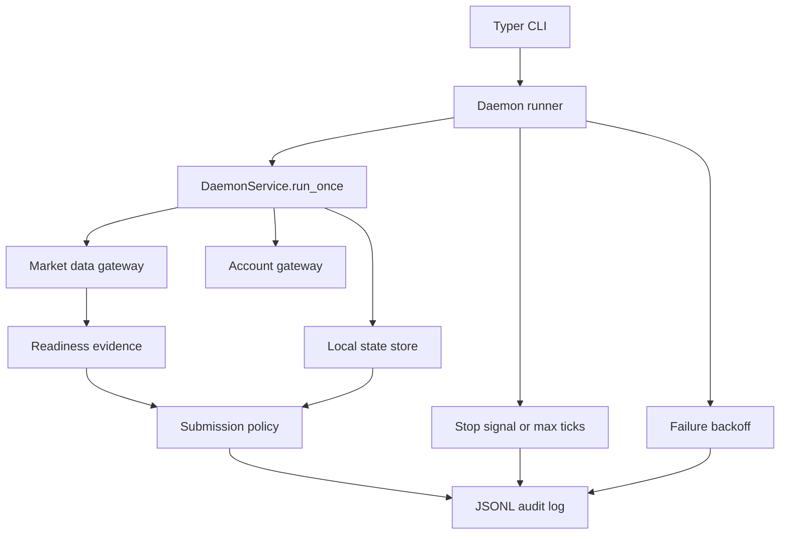
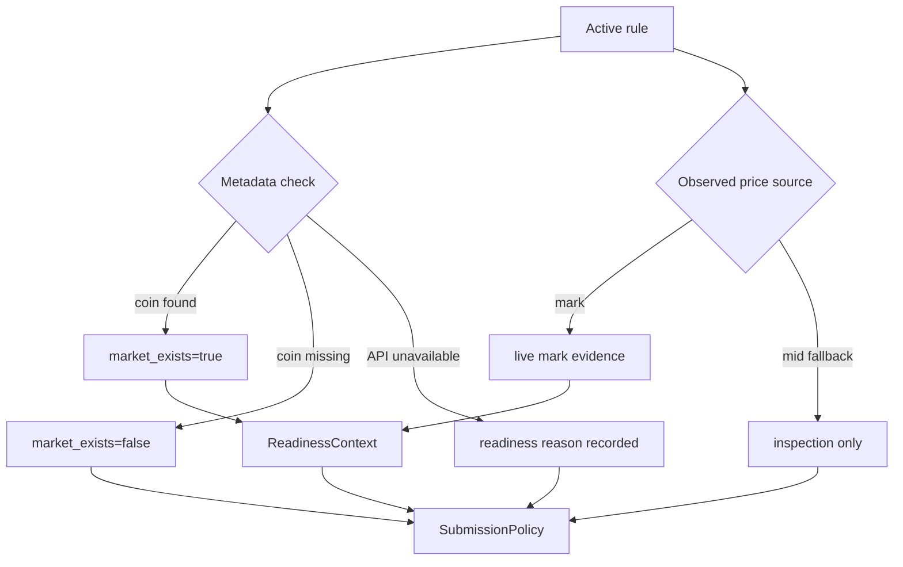

# MVP Live Readiness Hardening - Plan

## Goal Capsule

- **Objective:** Close the remaining MVP-readiness blockers so the project can move from local dry-run/private pilot to a credible live-trading MVP claim without weakening the existing safety model.
- **Authority hierarchy:** Preserve the June 29 daemon MVP Product Contract first, then this follow-up plan's narrowed readiness scope, then implementation-time SDK details discovered while coding.
- **Execution profile:** Standard/high-risk code plan because it touches continuous automation, external trading API evidence, live-readiness gates, packaging entrypoints, and operator documentation.
- **Stop conditions:** Stop and return to planning if implementation discovers that live readiness requires a custody/signing model beyond local Keychain-backed signing, or if Hyperliquid SDK/API behavior contradicts the assumptions behind mark-price evidence or reduce-only close safety.
- **Tail ownership:** `ce-work` or goal mode owns implementation, verification, review, and landing; the plan file is not updated with progress.

---

## Product Contract

### Summary

The current app is MVP-ready for local dry-run/private-pilot use but not yet ready to claim live automated trading readiness.
This plan targets the remaining blockers: no real continuous daemon loop, manual market-existence assertion, no documented safe integration smoke path, and a missing module entrypoint for `python -m` usage.

### Problem Frame

The original daemon MVP now has durable local state, dry-run defaults, readiness checks, audit events, and gateway-isolated live access.
That is enough for local testing, but a live-trading MVP needs stronger operational evidence: the daemon must run continuously under operator control, verify Hyperliquid market metadata instead of trusting a manual flag, provide a safe proof path before mainnet, and make documented commands match executable entrypoints.

### Requirements

#### Daemon Operation

- R1. The CLI must support a real continuous daemon loop in addition to the existing bounded `--once` tick.
- R2. The continuous loop must remain deterministic and bounded-testable without sleeping or opening network connections in normal tests.
- R3. The daemon must preserve the current kill-switch behavior and stop live submission quickly when the persisted kill switch becomes active.
- R4. Operator-visible audit events must distinguish repeated tick failures, account snapshot failures, market-data failures, blocked live submissions, and graceful daemon stops.

#### Live Readiness Evidence

- R5. Live readiness must verify rule markets against Hyperliquid metadata through the gateway layer instead of relying only on a manual `--market-exists` assertion.
- R6. Only mark-price observations, not mid-price fallback observations, may satisfy the live mark-price readiness gate.
- R7. `auto_submit` must continue to require Keychain key presence, inactive kill switch, prior dry-run audit evidence, exact confirmation phrase, live mark-price evidence, and verified market existence.
- R8. Readiness output and audit payloads must explain whether market existence and mark-price evidence came from live API checks, persisted state, or an unavailable check.

#### Safe MVP Proof

- R9. The repo must provide a documented smoke workflow that proves the CLI, storage, daemon tick, readiness blocks, and gateway wiring without placing a mainnet order.
- R10. A live or testnet preflight path must be read-only unless every existing live-submission gate passes; the default path must be safe for development machines without private keys.
- R11. The smoke workflow must make external API rate-limit posture visible enough that operators do not infer high-frequency polling is safe.

#### Packaging And Documentation

- R12. The package must support both the installed console script and `python -m hl_advanced_orders.cli` for CLI help and command execution.
- R13. README status and examples must distinguish dry-run/private-pilot readiness from live MVP readiness until the Verification Contract gates pass.
- R14. Documentation must point users to testnet or fake-gateway proof before mainnet use and preserve the local-only private-key safety model.

### Scope Boundaries

#### In Scope

- Continuous local loop behavior, stop handling, and backoff policy for the existing CLI daemon.
- Automated market metadata checks and readiness context construction through existing Hyperliquid gateway boundaries.
- Safe integration smoke workflows using fake gateways and read-only/testnet-style API checks.
- Packaging and README updates needed to make the MVP claim honest.

#### Deferred To Follow-Up Work

- OS service installation, launch agents, systemd units, background auto-start, and hosted deployment.
- Polished terminal UI, dashboards, alerting, notifications, or mobile/local GUI surfaces.
- Exchange-side trigger orders, advanced order types beyond trailing stops, and multi-account orchestration.
- Real-money mainnet dogfooding by the agent; implementation can prepare the checklist but cannot prove account-specific trading safety without operator credentials and consent.

---

## Planning Contract

### Key Technical Decisions

- KTD1. Add continuous operation as a runner around `DaemonService.run_once`, not inside the trailing engine.
  The engine and service already have deterministic tick tests; keeping loop timing, stop conditions, and backoff outside the engine preserves that testability.
- KTD2. Replace manual market readiness with gateway-owned metadata verification.
  Hyperliquid's public API separates read-only Info requests from signed Exchange actions, and the official docs state the same API shape is available on testnet using the testnet URL; market verification belongs in the read-only gateway path before readiness context construction.
- KTD3. Keep mid-price fallback useful for inspection but insufficient for live readiness.
  Hyperliquid documents `allMids` as a read-only midpoint endpoint with fallback behavior when the book is empty; the product contract requires mark price as the trigger source, so fallback data must not satisfy live mark evidence.
- KTD4. Make the safe proof path a first-class CLI workflow instead of a README-only checklist.
  The existing tests prove unit behavior, but an MVP claim needs a command-level smoke path that exercises storage, rules, daemon ticks, readiness blocks, and gateway wiring without live order placement.
- KTD5. Treat packaging parity as release quality, not polish.
  The installed `hl-advanced-orders` script works, but `python -m hl_advanced_orders.cli` currently does not invoke the Typer app; documented Python module execution should behave like the console script.

### High-Level Technical Design

The continuous runner owns lifecycle concerns: interval selection, bounded test mode, stop signals, failure backoff, and stop audit events.
`DaemonService` remains a single-tick coordinator that can be tested with fake gateways.

Readiness context should record the evidence source, not just booleans.
That lets CLI output and audit logs distinguish a missing market from an unavailable metadata check and prevents a manual flag from being mistaken for live verification.

### Sources & Research

- `docs/plans/2026-06-29-001-feature-hyperliquid-advanced-orders-daemon-plan.md` is the original implementation-ready daemon plan; this plan narrows to remaining readiness blockers rather than re-planning implemented persistence and dry-run behavior.
- `src/hl_advanced_orders/cli.py` currently runs one bounded tick with `--once`, requires manual `--market-exists` for `auto_submit`, and prints a scaffold message when `--once` is absent.
- `src/hl_advanced_orders/daemon.py` keeps daemon behavior deterministic through `run_once`, persists live mark observations only for `PriceSource.MARK`, and already refreshes the kill switch before live submission.
- `src/hl_advanced_orders/hyperliquid_client.py` already wraps SDK Info, account, fill, and Exchange operations; it lacks a public market-existence/preflight method.
- `tests/test_cli.py`, `tests/test_daemon.py`, `tests/test_hyperliquid_client.py`, and `tests/test_submission.py` already cover dry-run rule creation, bounded daemon ticks, mid-price fallback blocking, readiness reasons, live blocked paths, and exchange response failures.
- Hyperliquid's official API docs identify the Info endpoint as read-only information retrieval and state that examples use mainnet but can run against testnet at `https://api.hyperliquid-testnet.xyz`: https://hyperliquid.gitbook.io/hyperliquid-docs/for-developers/api
- Hyperliquid's official Exchange docs describe order requests with a reduce-only field and the signed Exchange endpoint as the trading surface: https://hyperliquid.gitbook.io/hyperliquid-docs/for-developers/api/exchange-endpoint
- Hyperliquid's official rate-limit docs list an aggregated REST limit of 1200 per minute, weighted Info requests, websocket limits, and recommend websockets for lowest-latency realtime data: https://hyperliquid.gitbook.io/hyperliquid-docs/for-developers/api/rate-limits-and-user-limits
- The installed `hyperliquid-python-sdk` exposes `Info.meta`, `Info.meta_and_asset_ctxs`, `Info.all_mids`, `Info.user_state`, `Info.user_fills`, `Info.subscribe`, `Exchange.market_close`, and `Exchange.order`; implementation must re-check signatures after dependency updates.

### Assumptions

- A polling loop is acceptable for MVP if interval defaults are conservative, rate-limit posture is documented, and the runner can later swap to websocket-fed observations.
- Market existence for the MVP can be verified from the SDK metadata universe for the configured perp dex; spot/remapped asset handling remains outside the trailing-stop MVP unless already supported by the current rule model.
- Testnet or read-only preflight proves API wiring and readiness behavior, but it does not prove mainnet account-specific profitability, liquidity, or operator risk tolerance.

### Risks & Dependencies

- **Trading safety risk:** A continuous loop can repeatedly encounter the same trigger.
  Mitigation: preserve triggered-state idempotency and blocked-live retry semantics, and test that live failures do not duplicate submissions.
- **Metadata drift risk:** Hyperliquid asset naming and remapping can change, especially for spot-style names.
  Mitigation: keep market verification behind the gateway and surface unknown/unavailable checks as readiness failures.
- **Rate-limit risk:** Naive polling across many rules could burn Info request budget.
  Mitigation: cache per-tick metadata, document conservative intervals, and defer websocket optimization until the MVP loop is correct.
- **False confidence risk:** A smoke workflow can prove plumbing while not proving live trading safety.
  Mitigation: label the workflow as preflight/smoke proof, preserve readiness gates, and keep mainnet auto-submit opt-in.
- **SDK drift risk:** The dependency allows `hyperliquid-python-sdk>=0.24.0`, so future SDK signatures may differ.
  Mitigation: gateway tests should pin behavior through fakes, and a manual SDK contract check remains part of the Verification Contract before live claims.

### System-Wide Impact

- **CLI contract:** `run`, `readiness`, and the new preflight workflow become operator safety surfaces, so help text and README examples must match behavior before the app claims live MVP readiness.
- **State lifecycle:** Continuous running increases the importance of durable state correctness; triggered flags, live mark evidence, fill checkpoints, kill-switch state, and audit history must survive restarts without duplicating submissions.
- **External API pressure:** Moving from one bounded tick to a loop can multiply Info requests across rules, so metadata checks should be cached per tick where practical and intervals should default conservatively.
- **Safety boundary:** Read-only gateway calls may happen during preflight and readiness, but exchange gateway construction and private-key retrieval must remain outside read-only workflows.
- **Failure recovery:** Repeated account, metadata, and mark-price failures should be auditable and recoverable without corrupting local state or forcing operators to delete state files.

---

## Implementation Units

### U1. Add Module Entrypoint And Packaging Parity

- **Goal:** Make module execution behave like the installed console script and document the supported entrypoints.
- **Requirements:** R12, R13
- **Dependencies:** None
- **Files:** `src/hl_advanced_orders/cli.py`, `tests/test_cli.py`, `README.md`
- **Approach:** Add a guarded module entrypoint that invokes the Typer app without changing console-script behavior.
  Add CLI tests that exercise `--help` through the module path using a subprocess or an equivalent import-safe runner.
  Keep the README development section focused on the installed command while noting module execution as a supported diagnostic path.
- **Patterns to follow:** Existing Typer app object in `src/hl_advanced_orders/cli.py`; current `CliRunner` tests in `tests/test_cli.py`.
- **Test scenarios:**
  - Running module help exits successfully and prints the same top-level command list as the console script.
  - Running module version exits successfully and prints the package version.
  - Importing `hl_advanced_orders.cli` in tests does not execute the CLI or mutate state.
  - Existing console-script invocation through Typer's runner still works for rule creation.
- **Verification:** Both supported entrypoints expose the same CLI surface, and README examples no longer leave `python -m` behavior ambiguous.

### U2. Introduce Continuous Daemon Runner

- **Goal:** Add a real local daemon loop while preserving deterministic single-tick testing.
- **Requirements:** R1, R2, R3, R4, R11
- **Dependencies:** U1
- **Files:** `src/hl_advanced_orders/daemon.py`, `src/hl_advanced_orders/cli.py`, `tests/test_daemon.py`, `tests/test_cli.py`
- **Approach:** Introduce a runner abstraction that repeatedly calls `DaemonService.run_once` with an operator-configurable interval and injectable sleep/stop controls.
  Keep `--once` as the bounded smoke/test path.
  The non-`--once` CLI path should require the same account and live-readiness setup needed to construct gateways, then run until stop signal, max-tick test option, or unrecoverable setup failure.
  Per-tick account or market failures remain audit events rather than process crashes unless setup itself is invalid.
- **Patterns to follow:** `DaemonService.run_once` in `src/hl_advanced_orders/daemon.py`; fake gateway tests in `tests/test_daemon.py`; CLI patching style in `tests/test_cli.py`.
- **Test scenarios:**
  - A runner with `max_ticks=3` calls `run_once` exactly three times and uses injected sleep between ticks.
  - A runner stops after an injected stop signal and writes a graceful stop audit event.
  - A `run_once` exception records a daemon tick failure audit event and continues after backoff when policy allows recovery.
  - Activating the persisted kill switch between ticks causes the next live-trigger path to block through the existing readiness context.
  - The CLI without `--once` no longer prints the scaffold message; it constructs the runner and delegates continuous operation.
  - The CLI continuous path can be tested with fake gateways and an injected bounded runner without network or Keychain access.
- **Verification:** The daemon can run continuously under CLI control, but tests can bound the loop without real sleeps, signals, network, or private keys.

### U3. Automate Market Verification In Readiness

- **Goal:** Replace manual `--market-exists` trust with gateway-owned Hyperliquid metadata verification and evidence-aware readiness output.
- **Requirements:** R5, R6, R7, R8, R10
- **Dependencies:** U2
- **Files:** `src/hl_advanced_orders/hyperliquid_client.py`, `src/hl_advanced_orders/readiness.py`, `src/hl_advanced_orders/cli.py`, `src/hl_advanced_orders/daemon.py`, `tests/test_hyperliquid_client.py`, `tests/test_cli.py`, `tests/test_daemon.py`, `tests/test_submission.py`
- **Approach:** Add a gateway method that checks whether a rule coin appears in Hyperliquid metadata for the configured market scope.
  Thread that result into `ReadinessContext` with enough evidence detail for CLI output and audit payloads.
  Keep a manual override only if it is explicitly named as an override and cannot silently satisfy live readiness when the live check failed or was not attempted.
  Continue to treat `PriceSource.MID` as non-live evidence for auto-submit.
- **Patterns to follow:** Existing `HyperliquidMarketDataGateway._mark_price_from_asset_context`; current readiness reason aggregation in `ReadinessChecker`; `live_mark_observed_rule_ids` persistence in `LocalDaemonState`.
- **Test scenarios:**
  - Metadata containing `ETH` makes the readiness context market-verified for an `ETH` rule.
  - Metadata missing `ETH` blocks readiness with a market-missing reason that includes the rule coin.
  - Metadata API failure blocks readiness with an unavailable-check reason and does not fall back to manual success.
  - A mid-price fallback observation can update inspection output but cannot set `observed_live_mark_price` for readiness.
  - A mark-price observation plus verified metadata, prior dry-run audit, valid key, inactive kill switch, and exact phrase allows the policy to reach the live submission gateway.
  - Readiness CLI output identifies whether market evidence was verified live, missing, or unavailable.
- **Verification:** No `auto_submit` path can pass readiness solely because the operator supplied `--market-exists`; readiness evidence is derived from gateway checks and persisted mark observations.

### U4. Add Safe Preflight And Smoke Workflow

- **Goal:** Provide a command-level proof path that exercises MVP wiring without placing a mainnet order.
- **Requirements:** R9, R10, R11, R13, R14
- **Dependencies:** U2, U3
- **Files:** `src/hl_advanced_orders/cli.py`, `src/hl_advanced_orders/hyperliquid_client.py`, `tests/test_cli.py`, `tests/test_hyperliquid_client.py`, `README.md`
- **Approach:** Add a preflight or smoke command that reports environment, package entrypoint, state directory, configured base URL, metadata reachability, account snapshot reachability when an address is provided, mark-price evidence for a coin, and readiness status for a rule when a rule ID is provided.
  The command must be read-only by default and must never construct an exchange gateway or retrieve a private key unless the operator explicitly asks to verify Keychain presence.
  Support fake-gateway test injection so the workflow is covered without live network access.
- **Patterns to follow:** Existing `readiness` command output style; current gateway wrapper fakes in CLI tests; `AuditEvent.create` for preflight audit records when a rule ID is involved.
- **Test scenarios:**
  - Preflight with fake metadata and no account address reports package/entrypoint health, state path, market verification, and mark-price source without touching Keychain.
  - Preflight with a rule ID reports the same readiness blockers as the readiness command, but labels the run as read-only.
  - Preflight against a fake testnet base URL passes the base URL through to the market-data gateway.
  - Preflight with metadata failure exits nonzero or warning-status according to the chosen CLI convention and records the failure reason without deleting state.
  - Preflight help text states that the command does not submit orders.
  - README smoke workflow can be followed with dry-run/default settings and does not require a private key.
- **Verification:** A developer can prove CLI wiring, state, metadata, mark-price, and readiness-block behavior from a safe command-level workflow before considering mainnet.

### U5. Align Documentation And MVP Status

- **Goal:** Make README and operator-facing text accurately describe private-pilot, preflight, and live-MVP readiness.
- **Requirements:** R11, R13, R14
- **Dependencies:** U1, U2, U3, U4
- **Files:** `README.md`, `tests/test_cli.py`, `tests/test_docs_examples.py`
- **Approach:** Update status wording so the README does not imply live automated readiness before the new gates exist.
  Document dry-run workflow first, then preflight/testnet proof, then the conditions for enabling `auto_submit`.
  Mention conservative polling/rate-limit posture and the planned transition path toward websocket-fed market data without making websocket work part of this MVP hardening plan.
  Add documentation consistency tests for the commands and phrases that are most likely to drift.
- **Patterns to follow:** Existing README Safety Model and Local Workflow sections; CLI tests that inspect command output and help text.
- **Test scenarios:**
  - README mentions `python -m unittest discover -s tests` and every documented command exists in CLI help.
  - README describes `dry_run` as the default and preserves the exact mainnet confirmation phrase.
  - README documents preflight or smoke workflow before mainnet `auto_submit` instructions.
  - README does not tell users to pass a manual market-exists flag as the normal live-readiness path after U3 lands.
  - CLI help for continuous run and preflight makes the no-order-submission or live-submission behavior clear.
- **Verification:** A new operator reading README can distinguish safe local proof, read-only live/testnet checks, and the gated mainnet auto-submit path without inspecting source code.

---

## Verification Contract

| Gate | Applies to | Expected signal |
|---|---|---|
| `python -m unittest discover -s tests` | All units | All unit and integration-style tests pass through the documented discovery path. |
| `ruff check .` | All units | Lint passes under the repo's configured Python target and line length. |
| Entrypoint parity smoke | U1 | Console script and module execution both show help/version and expose the same top-level commands. |
| Bounded daemon runner smoke | U2 | A fake-gateway continuous run executes multiple ticks, records stop/failure audit events, and can be stopped without sleeping in tests. |
| Readiness evidence audit | U3 | Auto-submit readiness cannot pass without gateway-verified market metadata and persisted mark-price evidence. |
| Safe preflight smoke | U4 | Preflight reports metadata, mark-price source, readiness blockers, and base URL while remaining read-only by default. |
| Documentation parity | U5 | README examples match CLI help, preserve the exact confirmation phrase, and route users through dry-run/preflight before mainnet. |
| Manual SDK contract check | U3, U4 | Before any live-MVP claim, re-check installed SDK signatures for Info metadata, user state/fills, and Exchange market close behavior against official docs. |

---

## Definition of Done

- Continuous daemon operation exists behind the CLI, remains bounded-testable, and preserves single-tick behavior for tests and smoke checks.
- Live readiness derives market existence from Hyperliquid metadata checks and mark-price evidence from `PriceSource.MARK`, not from mid-price fallback or a normal manual assertion.
- `auto_submit` still cannot reach the exchange gateway unless all existing readiness gates pass, including Keychain key presence, prior dry-run audit evidence, inactive kill switch, exact phrase, verified market, and live mark observation.
- A safe preflight or smoke workflow proves CLI/storage/gateway/readiness wiring without placing a mainnet order.
- `python -m hl_advanced_orders.cli --help` behaves consistently with the installed console script.
- README and CLI help accurately describe private-pilot status, preflight/testnet proof, rate-limit posture, and the gated mainnet path.
- Verification Contract gates pass, and unused scaffold wording or dead experimental code is removed before handoff.
